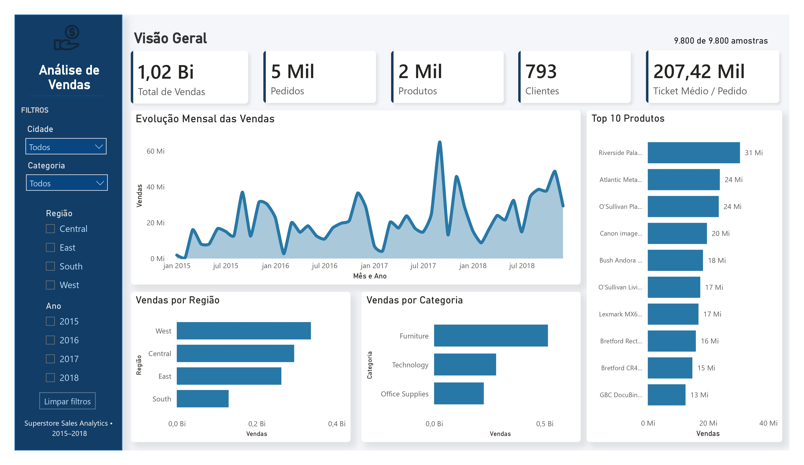
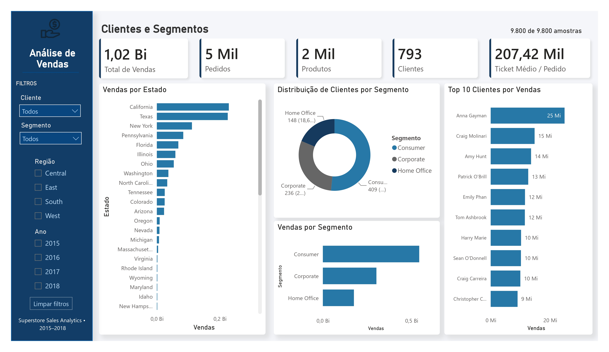
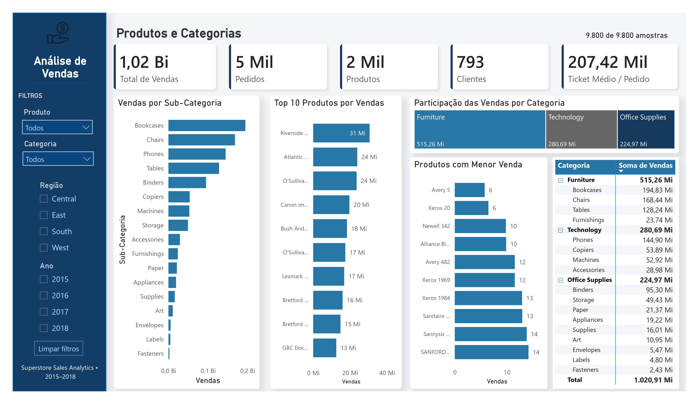
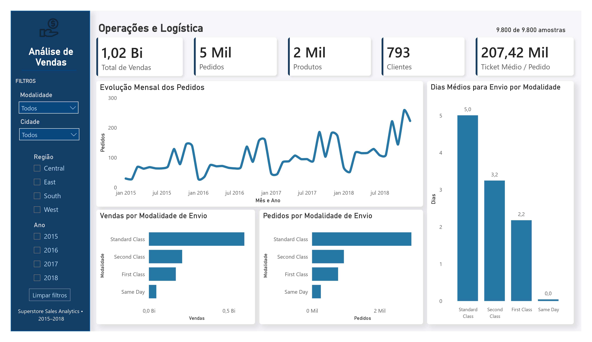

# Superstore Sales Analytics

Power BI dashboard developed to analyze sales, customers, products and logistics using the Superstore dataset.

The project transforms transactional data into an interactive dashboard, allowing users to explore business performance through KPIs, charts, rankings, detailed tables and dynamic filters.

## Project Overview

The dataset contains 9,800 records from 2015 to 2018.

The dashboard is divided into four pages, each focused on a different aspect of the business:

- Overview
- Customers & Segments
- Products & Categories
- Operations & Logistics

Filters are available throughout the dashboard, allowing the analysis to be segmented by dimensions such as year, region, category, product, customer, city, segment and shipping method.

The number of records included in the current analysis is also displayed and updates according to the applied filters.

## Dashboard Pages

### 1. Overview

Provides a general view of sales performance.

Main indicators and analyses:

- Total Sales
- Total Orders
- Total Products
- Total Customers
- Average Ticket per Order
- Monthly Sales Evolution
- Sales by Region
- Sales by Category
- Top 10 Products by Sales



### 2. Customers & Segments

Focuses on customer behavior and segmentation.

Main analyses:

- Number of Customers
- Number of Orders
- Total Sales
- Average Ticket per Order
- Sales by State
- Top 10 Customers by Sales
- Customer Distribution by Segment
- Sales by Segment



### 3. Products & Categories

Analyzes product performance across categories and sub-categories.

Main analyses:

- Number of Products
- Number of Orders
- Total Sales
- Average Ticket per Order
- Sales by Sub-Category
- Top 10 Products by Sales
- Products with Lower Sales
- Sales by Category
- Detailed Category and Product Sales Matrix



### 4. Operations & Logistics

Focuses on order and shipping performance.

Main indicators and analyses:

- Total Sales
- Total Orders
- Average Shipping Days
- Percentage of Same-Day Orders
- Monthly Order Evolution
- Sales by Shipping Method
- Orders by Shipping Method
- Average Shipping Days by Shipping Method



## Tools

- Microsoft Power BI
- Power Query
- DAX
- Data Modeling
- Data Visualization

## Analysis

The dashboard was built to answer practical business questions, such as:

- How are sales evolving over time?
- Which regions generate the most sales?
- Which categories and sub-categories have the highest sales?
- Which products and customers contribute most to revenue?
- How are customers distributed across segments?
- Which shipping methods are most frequently used?
- How long does each shipping method take on average?
- How do the results change when different filters are applied?

## Repository Structure

```text
superstore-sales-analytics/
│
├── dashboard/
│   └── Dashboard_Superstore.pbix
│
├── images/
│   ├── Overview_Dashboard_Superstore_page_1.jpg
│   ├── Customers_Dashboard_Superstore_page_2.jpg
│   ├── Products_Dashboard_Superstore_page_3.jpg
│   └── Operations_Dashboard_Superstore_page_4.jpg
│
├── report/
│   └── Dashboard_Superstore.pdf
│
└── README.md
